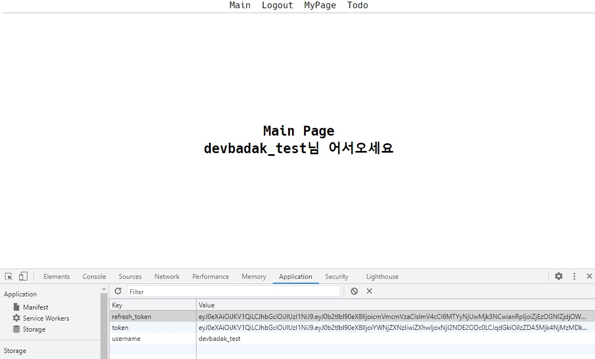

# React & Redux를 활용한 User 기능 구현

## 목차

- [프로젝트 소개](#프로젝트-소개)   
- [텍스트 ... ](#프로젝트-소개)   
- [프로젝트 명세](#프로젝트-명세)
  - [배포 환경](#배포-환경)
  - [개발 환경](#개발-환경)
  - [Design Resources](#design-resources)
  - [핵심 라이브러리](#핵심-라이브러리)
   

## 프로젝트 소개
기존에 학습했던 Vue js에서 벗어나 React js를 활용하여

API통신을 통한 기본적인 User 회원가입 / 로그인 / 로그아웃 기능을 구현해 보았다.

 

## 프로젝트 명세

### 배포 환경
- __배포 여부__ : X
- __접속 가능__ : 접속 불가능
- __HTTPS 적용__ : X
   

### 개발 환경
#### Front-end / Android
- __Framework__ : React
- __지원 환경__ : Web
- __담당자__ : 최창영
 

#### Design
- __Design Tool 사용__ : figma
- __담당자__ : 최창영
 

### 개발 내용

- ##### 컴포넌트 구조

- ##### 화면

1. ##### 메인페이지

2. ##### 회원가입 페이지

3. ##### 로그인 페이지

4. ##### 로그인 성공 시 메인페이지

기본적으로 로그인 성공 시 즉시 Main페이지로 이동하도록 구현하였으며,

LocalStorage에 유저 정보와 토큰을 저장해주었습니다.

5. ##### 회원가입 성공 시 메인페이지

회원 가입 이후에도 마찬가지로 로그인 logic이 실행되며 

토큰와 유저정보를 LocalStorage에 저장한 뒤 Main페이지로 가도록 하였습니다.

6. ##### Todo 페이지

로그인이 안된 상태에서 페이지 이동을 요청할 경우 알림을 띄우고 로그인 페이지로 돌아가도록 하였습니다.

로그인이 된 상태에서는 Todo 페이지로 성공적으로 로딩이 됩니다.

### 느낀점

아직 익숙치 않은 React를 활용하여 비동기 통신을 통한 기능을 구현하려다 보니

버벅이는 부분이 많았던 것 같습니다.

특히나 jwt토큰을 처리하는데 있어 일단은 localStorage에 저장을 했지만, 찾아보니 localStorage에 저장하지 않고 다른 형식으로 하는 방법도 있었으며 그 방식이 보안적으로 더 우수했던 것 같아 추가적인 학습이 필요할 것 같습니다.
